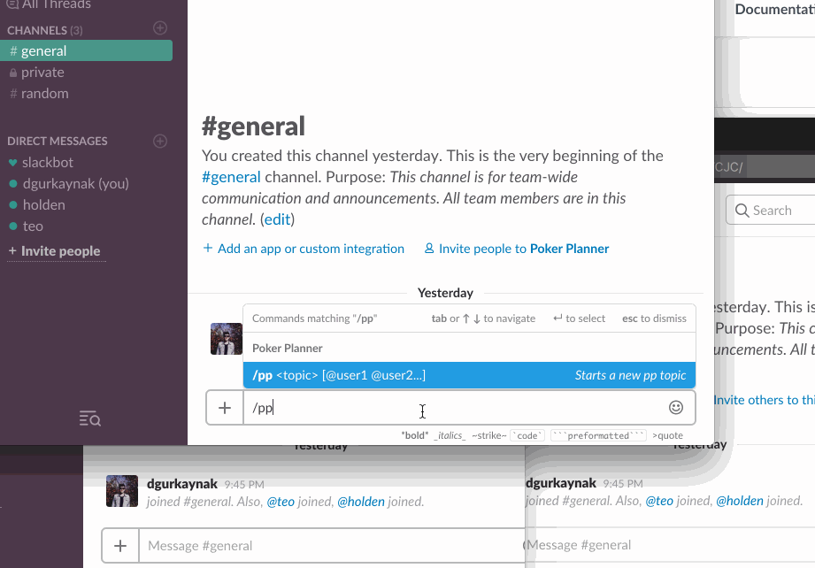

# Poker Planner for Slack

This project lets you make estimations with planning poker (or scrum poker) directly in Slack, without any need of external software.
It can be a useful tool for agile remote teams.

## Features

- Automatically adds active (online) users of current channel as participants
to poker planning sessions
- You can also explicitly set the participants with `@user`, `@channel`, `@here` and group mentions
- Once all the participants are voted, the votes are automatically revealed
- Customizable poker values for your team

## Installation

- Visit the website: [https://deniz.co/slack-poker-planner/](https://deniz.co/slack-poker-planner/)
- Click **"Add to Slack"** button
- Select the team you want to install Poker Planner from the dropdown top right
- Click **Allow** button

## Usage

For detailed usage documentation, please visit [website](https://deniz.co/slack-poker-planner/#usage).

## Self-hosting

If you want to host your own app, follow this steps:

### Creating slack app

- Create a new Slack app [from here](https://api.slack.com/apps).
- Create a new Slash Command `/pp` (or any command you want) and set request url as `http://my.awesome.project.url/slack/pp-command`
    - Make sure that "Escape channels, users, and links sent to your app" option is turned on
- Activate Interactive Messages with request url `http://my.awesome.project.url/slack/action-endpoint`, options load url is not used, you can leave it blank.
- Add a new OAuth Redirect URL: `http://my.awesome.project.url/oauth`
- Required permission scopes: `commands`, `channels:read`, `chat:write:bot`, `groups:read`, `users:read`

### Running

- Clone this repo
- Install dependencies with `npm i`
- Start the app with `npm start`

**Environment variables:**
- **`PORT`**: Port number for webserver. Default: `3000`
- **`BASE_PATH`**: If you're not serving from root, set this variable. Default: `/`
- **`SLACK_CLIENT_ID`**: Slack client id, default null
- **`SLACK_CLIENT_SECRET`**: Slack client secret, default null
- **`SLACK_VERIFICATION_TOKEN`**: Slack verification token, default null
- **`SLACK_APP_ID`**: Slack app id, default null
